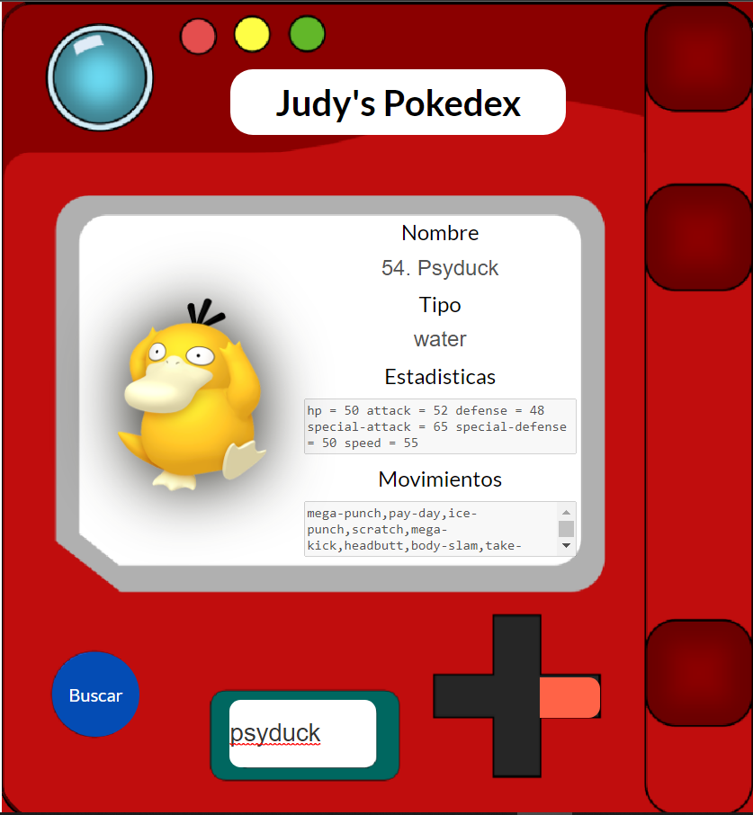
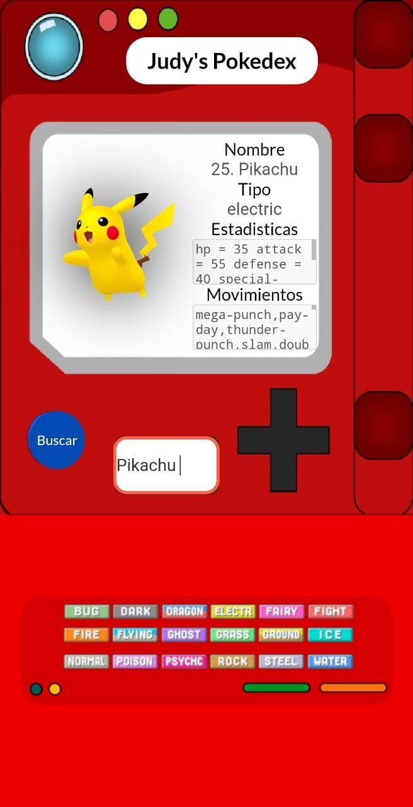

# FrontEnd-Mision-Training????

### Pr¨¢ctica JS - Pokedex

[Page (https://doguedogue.github.io/pokedex/index.html)](https://doguedogue.github.io/pokedex/index.html)

Vista Escritorio

Vista Celular (Responsive)

### Instrucciones

* Maquetaci¨®n del sitio con HTML
* Dise?o con CSS para que parezca un pokedex la p¨¢gina, aqu¨ª les dejo una im¨¢gen de uno, pero pueden volar su creatividad a como gusten.
* Tener un input de entrada, donde se meta el nombre del pok¨¦mon a buscar.
* Tomar ese input e ir a consultar el API de [pokeapi](https://pokeapi.co/)
* mostrar en pantalla los siguientes datos del pok¨¦mon ingresado:
  * Nombre
  * Im¨¢gen
  * Tipo de pok¨¦mon
  * Estad¨ªsticas
  * Movimientos

Bonus:

* Bonus si tu p¨¢gina es responsive y se puede ver en celulares
* Bonus de despliegue de tu pok¨¦dex
* Bonus de uso de otras rutas como b¨²squeda por n¨²mero de pok¨¦mon o mostrar un rango de pok¨¦mons.
